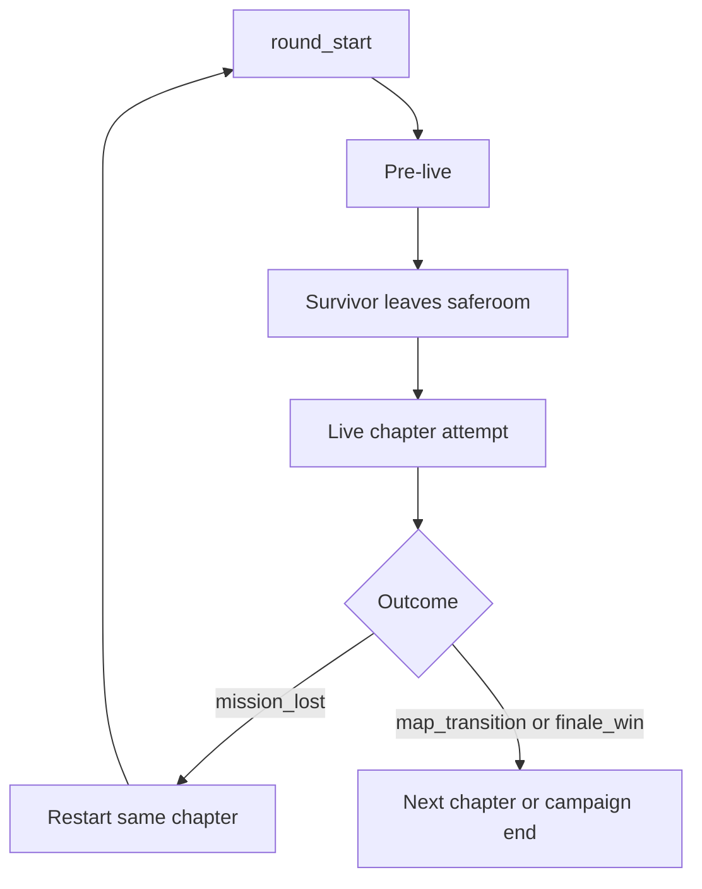
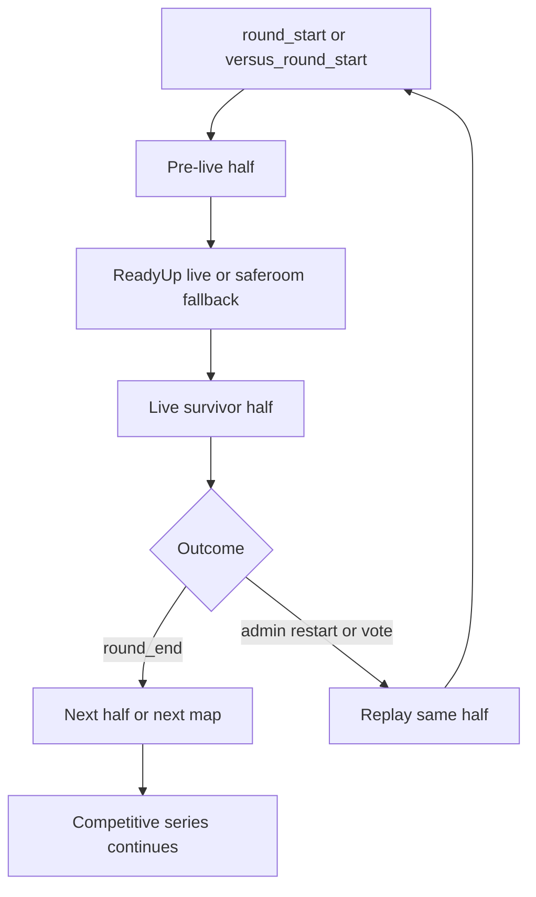
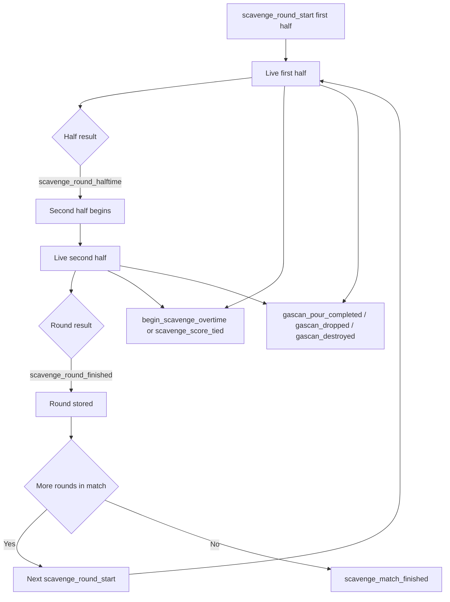
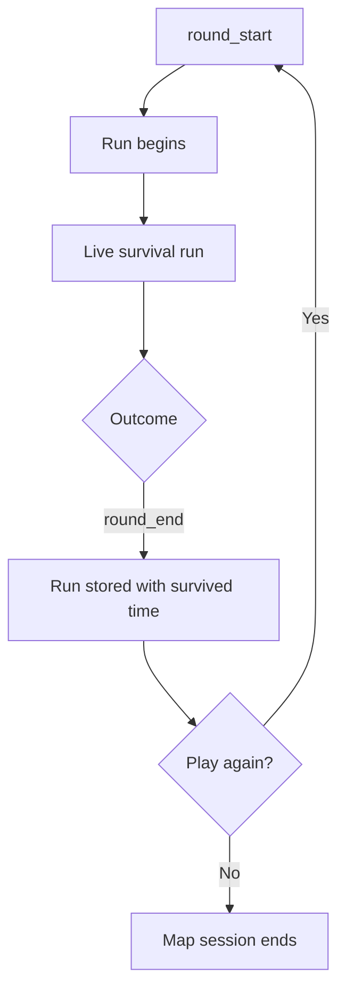

# Reglas de Negocio del Ciclo de Vida por Modo en L4D2

Este documento define las diferencias de negocio y de flujo entre `Coop`, `Versus`, `Scavenge` y `Survival`.

Está escrito de forma intencionalmente abstracta y reutilizable.

El objetivo es servir como contrato base para cualquier plugin o sistema que necesite razonar sobre:

- inicio y fin de ronda
- estado preparatorio vs estado live
- reinicios y reintentos
- persistencia por ronda vs persistencia agregada
- transición natural de mapa vs repetición del mismo contexto

La idea central es que los cuatro modos no solo cambian la condición de victoria, sino también la **unidad temporal dominante** y la forma en que el juego interpreta el progreso.

## Alcance

Este documento define:

- qué significa una `ronda` en cada modo
- qué significa un `match`, `serie` o `run` en cada modo
- qué eventos del juego son mejores anclas de lifecycle
- qué tipo de restart es significativo según el modo
- qué tipo de persistencia es natural en cada modo

Este documento no define:

- nombres de comandos
- nombres de cvars
- formato de almacenamiento
- diseño de UI
- detalle de tracking de daño, precisión o skills

## Términos Base

### Ronda

La unidad mínima de juego que puede tratarse como un segmento discreto y jugable con:

- una fase de preparación
- una fase live
- una condición de cierre

Ejemplos:

- una mitad survivor en `Versus`
- una mitad de `Scavenge`
- un intento de capítulo en `Coop`
- una corrida en `Survival`

### Fase Live

La parte de la ronda donde el juego ya debe contarse como progreso real para estadísticas, rating o scoring.

No siempre coincide con el primer evento del motor que indica que la ronda “existe”.

### Match / Serie / Historial de Runs

Un agregado superior que abarca más de una ronda.

El alcance correcto depende del modo:

- progresión de campaña
- secuencia competitiva multi-mapa
- match multi-mitad en un solo mapa
- múltiples intentos en el mismo mapa

### Sub-modo

Una variante operativa que hereda el ciclo de vida del modo base.

Ejemplos:

- competitivo sobre `Versus`
- competitivo sobre `Scavenge`

Regla general:

- un sub-modo no redefine la identidad base del modo
- solo ajusta reglas operativas, contexto competitivo o señales auxiliares
- el flujo principal debe seguir anclado al modo base

### Unidad Temporal Dominante

La unidad temporal dominante es la escala que organiza el progreso real del modo.

Ejemplos:

- en `Coop` domina el **capítulo**
- en `Survival` domina el **tiempo sobrevivido**
- en `Versus` domina la **mitad por capítulo** dentro de una serie
- en `Scavenge` domina la **ronda corta con reloj**

Este concepto es útil porque explica por qué una misma señal del motor puede tener significados de negocio diferentes según el modo.

### Restart

La repetición del mismo mapa, capítulo o contexto de ronda sin avanzar de forma natural a la siguiente unidad jugable.

Debe distinguirse de:

- halftime
- siguiente mapa
- siguiente capítulo
- cierre normal del match

## Modelo por Modo

### Coop

Modelo de juego:

- un solo equipo de survivors progresa por una campaña
- un fallo puede reiniciar el mismo capítulo
- la continuidad de campaña importa más que la simetría competitiva

Unidad natural de ronda:

- un intento live sobre el capítulo actual

Características importantes del lifecycle:

- existe una fase pre-live, aunque suele ser breve o informal
- salir del saferoom suele ser la mejor frontera práctica de “inicio real”
- el fallo de campaña y su reintento son estados de juego de primera clase
- la transición de mapa es una forma natural de progresión
- la economía de recursos entre capítulos es parte del significado del modo

Alcance natural de persistencia:

- intento actual del capítulo
- run actual de la campaña

Persistencia natural del modo:

- vida restante
- recursos consumidos
- desgaste acumulado del equipo

En `Coop`, persistencia de progreso y persistencia de recursos suelen ir juntas.

Significado de restart:

- repetición del capítulo tras un fallo

Señales útiles:

- `round_start`
- salida del saferoom o equivalente como señal de live
- `mission_lost`
- `map_transition`
- `finale_win`

Flujo de referencia:

### Versus

Modelo de juego:

- modo competitivo simétrico
- puede tener un sub-modo competitivo encima sin dejar de ser `Versus`
- las rondas son mitades
- cada mitad pertenece a una secuencia competitiva mayor
- el tamaño del equipo y el pool de SI pueden variar por reglas del servidor

Unidad natural de ronda:

- una mitad survivor

Características importantes del lifecycle:

- la fase pre-live es importante
- la transición a live puede estar retrasada por sistemas externos como `readyup`
- el halftime no es un restart
- los jugadores se invierten de equipo entre mitades
- al invertirse los equipos, la capa de tracking survivor debe empezar un registro nuevo para la mitad siguiente
- los restarts administrativos deben tratarse por separado del progreso de juego
- la persistencia entre mapas no debe entenderse como economía de recursos, sino como continuidad competitiva de la serie

Alcance natural de persistencia:

- mitad actual
- serie competitiva multi-mapa actual

Persistencia natural del modo:

- score acumulado
- orden lógico de las mitades
- continuidad del match

En `Versus`, la persistencia competitiva importa más que la persistencia de recursos.

Significado de restart:

- repetición administrativa del capítulo o mitad actual
- no representa fallo de campaña

Señales útiles:

- `round_start`
- `versus_round_start`
- señales de “round is live” provenientes de sistemas de match cuando existan
- salida del saferoom como fallback si no existe un sistema de readyup
- `round_end`
- `versus_match_finished`
- votos exitosos de restart

Flujo de referencia:

### Scavenge

Modelo de juego:

- modo competitivo con flujo explícito de mitades
- puede tener un sub-modo competitivo encima sin dejar de ser `Scavenge`
- no está basado en fallo de campaña
- normalmente opera como un match multi-mitad sobre un solo mapa

Unidad natural de ronda:

- una mitad de `Scavenge`

Características importantes del lifecycle:

- pueden existir eventos genéricos de ronda, pero los eventos propios de `Scavenge` son más autoritativos
- el halftime es parte normal de la estructura del match
- los jugadores se invierten de equipo entre mitades
- al invertirse los equipos, la capa de tracking survivor debe empezar un registro nuevo para la mitad siguiente
- el fin del match no es lo mismo que el fin de una mitad
- el replay o restart es administrativo, no producto de fallo de capítulo
- el tiempo es un recurso explícito del modo, no solo una métrica externa
- el estado de primera mitad vs segunda mitad es parte explícita del contexto de negocio
- el número de ronda del match y la meta de bidones son contexto útil, no solo detalle técnico del motor
- overtime y empates de score son hitos relevantes del modo y deben poder observarse de forma explícita

Alcance natural de persistencia:

- mitad actual
- match actual de `Scavenge` en el mapa actual

Persistencia natural del modo:

- bidones o progreso equivalente de la mitad
- tiempo restante o tiempo consumido
- resultado por rondas del match
- meta de bidones del round
- mitad actual dentro de la ronda
- estado de overtime o empate si ocurren

En `Scavenge`, la persistencia natural está más cerca de un match corto por rondas que de una campaña.

Datos observables recomendados:

- `scavenge_round_number`
- `second_half`
- `items_goal`
- `overtime`
- `score_tied`

Métricas específicas de jugador que son naturales en `Scavenge`:

- bidones vertidos
- bidones soltados
- bidones destruidos

Significado de restart:

- repetición administrativa del contexto actual de mapa o match

Señales útiles:

- `scavenge_round_start`
- `scavenge_round_halftime`
- `scavenge_round_finished`
- `scavenge_match_finished`
- `begin_scavenge_overtime`
- `scavenge_score_tied`
- `gascan_pour_completed`
- `gascan_dropped`
- `scavenge_gas_can_destroyed`
- votos exitosos de restart

Flujo de referencia:

### Survival

Modelo de juego:

- modo de resistencia basado en duración
- es normal tener múltiples encuentros con bosses
- el score está fuertemente ligado a la duración del intento

Unidad natural de ronda:

- una corrida de `Survival`

Características importantes del lifecycle:

- la fase pre-live suele ser menor que en `Versus`
- el run está normalmente acotado al mismo mapa
- repetir el mismo mapa es comportamiento natural y no debe confundirse con progresión de campaña
- el tiempo sobrevivido es el output principal del modo

Alcance natural de persistencia:

- run actual
- historial opcional de runs en el mismo mapa

Persistencia natural del modo:

- duración del run
- hitos internos del run
- comparación entre intentos del mismo mapa

En `Survival`, el progreso natural es temporal, no territorial ni de campaña.

Significado de restart:

- repetición del mismo contexto de run en el mismo mapa

Señales útiles:

- `round_start`
- `round_end`
- señales específicas del modo si alguna integración externa las expone
- votos exitosos de restart

Flujo de referencia:

## Semántica del Lifecycle por Modo

| Modo | Unidad natural de ronda | Agregado natural | Significado de restart |
|---|---|---|---|
| Coop | intento de capítulo | run de campaña | repetición por fallo |
| Versus | mitad survivor | serie competitiva multi-mapa | repetición administrativa |
| Scavenge | mitad de scavenge | match en un solo mapa | repetición administrativa |
| Survival | run de survival | historial de runs del mismo mapa | repetición del run |

## Modo Base vs Sub-modo

Para efectos de lifecycle:

- `Versus` y `Scavenge` son modos base
- “competitivo” debe tratarse como un sub-modo
- ese sub-modo puede vivir sobre `Versus` o sobre `Scavenge`

Implicancia:

- no corresponde modelar “competitivo” como un modo base separado
- el flujo de ronda, live, halftime, cierre y restart debe seguir el modo base
- lo competitivo agrega contexto, reglas y señales auxiliares, pero no cambia la ontología principal del modo

## Implicancias de Negocio

### Persistencia de recursos vs persistencia competitiva

No todos los modos persisten “lo mismo”.

En términos abstractos:

- `Coop` persiste progreso y desgaste
- `Versus` persiste score y continuidad del match
- `Scavenge` persiste resultado por rondas y manejo del reloj
- `Survival` persiste duración y comparación entre runs

Por eso un sistema genérico no debería asumir que “persistencia” significa siempre:

- vida
- inventario
- score
- progreso territorial

### Diferencia entre progreso natural y restart

Un progreso natural puede ser:

- pasar al siguiente capítulo
- pasar a la siguiente mitad
- cerrar una ronda y seguir al siguiente turno

Un restart, en cambio, implica:

- repetir el mismo contexto jugable
- sin avanzar a la siguiente unidad dominante del modo

Esta diferencia es clave para cualquier sistema de estadísticas, score o histórico.

## Reglas para la Transición a Live

### Coop

Modelo recomendado:

- una ronda puede existir antes de que el intento sea estadísticamente significativo
- salir del saferoom suele ser la frontera live más útil

### Versus

Modelo recomendado:

- hay una diferencia fuerte entre “la mitad existe” y “la mitad está live”
- las señales de readyup o de match-live deben tener prioridad sobre supuestos genéricos

### Scavenge

Modelo recomendado:

- los eventos específicos de `Scavenge` deben preferirse sobre eventos genéricos
- el halftime es parte del flujo normal, no un fallo
- la segunda mitad no debe modelarse como restart
- el fin del match no debe borrar prematuramente el contexto histórico de la última ronda
- los eventos de bidones deben tratarse como métricas propias del modo, no como soporte genérico o utilidades comunes

### Survival

Modelo recomendado:

- la ronda y el run suelen ser la misma unidad conceptual

## Semántica de Restart

### Coop

La señal más fuerte de restart es el fallo del capítulo actual.

Debe diferenciarse de:

- completar el capítulo
- transición natural de mapa

### Versus

Las señales más fuertes de restart son administrativas:

- votos de restart
- replay forzado del mismo capítulo o mitad

No deben confundirse con:

- halftime
- siguiente mitad
- siguiente mapa

### Scavenge

Las señales más fuertes de restart también son administrativas.

No deben confundirse con:

- `scavenge_round_halftime`
- `scavenge_round_finished`
- `scavenge_match_finished`

### Survival

Restart significa repetir el mismo contexto de run.

No debe tratarse como progresión de campaña.

## Preferencia de Eventos Canónicos

Cuando existan múltiples eventos posibles, debe preferirse la señal más específica del modo.

Regla general:

1. evento específico del modo
2. señal autoritativa externa de match/live
3. evento genérico de ronda
4. fallback por teardown

Ejemplos:

- en `Scavenge`, preferir `scavenge_round_start` sobre `round_start`
- en `Scavenge`, preferir `scavenge_round_finished` sobre `round_end`
- en `Scavenge`, usar `scavenge_match_finished` como señal fuerte de boundary del match
- en `Scavenge`, tratar `gascan_pour_completed` como señal autoritativa de progreso de objetivo por jugador
- en `Versus`, preferir señales de match-live o readyup sobre “la ronda ya existe”
- en `Coop`, preferir señales de fallo o transición antes que asumir semánticas competitivas
