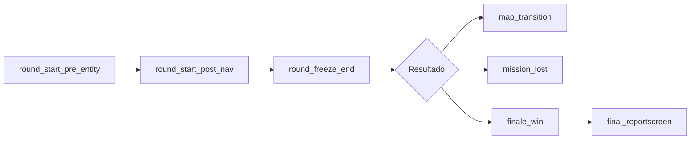
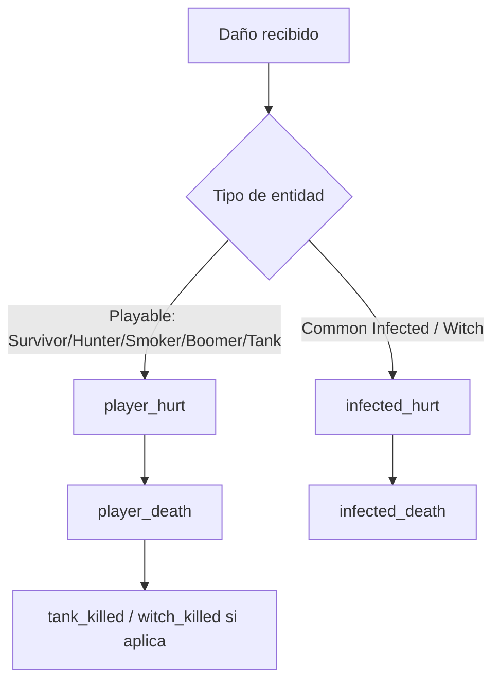

# L4D Game Events
> Referencia convertida a Markdown desde una copia de la página de Valve Developer Community: `https://developer.valvesoftware.com/wiki/List_of_L4D_Game_Events`.
> El contenido original conserva los nombres de eventos, tipos de campos y descripciones en inglés para evitar romper referencias técnicas.

---

## Resumen
- **Eventos documentados:** 155
- **Formato de cada evento:** nombre, nota opcional y estructura de campos.
- **Uso típico en SourceMod:** `HookEvent("event_name", Callback)` y lectura de campos con `GetEventInt`, `GetEventBool`, `GetEventString` o `GetEventFloat`, según corresponda.
- **Advertencia práctica:** eventos marcados como `local` o “too spammy” pueden ser muy frecuentes. Si esto se usa para un plugin de skills/stats, conviene filtrar temprano y no convertir el servidor en una tostadora con logs.

---

## Convenciones de tipos

| Tipo | Lectura típica en SourceMod | Nota |
|---|---|---|
| `short`, `byte`, `long` | `GetEventInt(event, "campo")` | Enteros con distinto tamaño en la definición del evento. |
| `bool` | `GetEventBool(event, "campo")` | Booleano. |
| `string` | `GetEventString(event, "campo", buffer, sizeof(buffer))` | Texto o classname/nombre de arma. |
| `float` | `GetEventFloat(event, "campo")` | Coordenadas o valores decimales. |
| `None` | No aplica | Evento sin campos útiles declarados. |

---

## Diagramas rápidos

### Flujo general de ronda / misión



### Ruta básica de daño / muerte



---

## Categorías sugeridas

### Jugador, bot, equipo y estado
[`player_team`](#player_team), [`player_bot_replace`](#player_bot_replace), [`bot_player_replace`](#bot_player_replace), [`player_afk`](#player_afk), [`player_footstep`](#player_footstep), [`player_jump`](#player_jump), [`player_blind`](#player_blind), [`player_ledge_grab`](#player_ledge_grab), [`player_ledge_release`](#player_ledge_release), [`player_transitioned`](#player_transitioned), [`player_first_spawn`](#player_first_spawn), [`player_shoved`](#player_shoved), [`player_jump_apex`](#player_jump_apex), [`player_blocked`](#player_blocked), [`relocated`](#relocated), [`respawning`](#respawning), [`spec_target_updated`](#spec_target_updated), [`player_talking_state`](#player_talking_state), [`ghost_spawn_time`](#ghost_spawn_time)

### Armas, ítems y munición
[`weapon_fire`](#weapon_fire), [`weapon_fire_on_empty`](#weapon_fire_on_empty), [`weapon_reload`](#weapon_reload), [`weapon_zoom`](#weapon_zoom), [`ammo_pickup`](#ammo_pickup), [`item_pickup`](#item_pickup), [`grenade_bounce`](#grenade_bounce), [`hegrenade_detonate`](#hegrenade_detonate), [`give_weapon`](#give_weapon), [`pills_used`](#pills_used), [`pills_used_fail`](#pills_used_fail), [`weapon_given`](#weapon_given), [`weapon_give_duplicate_fail`](#weapon_give_duplicate_fail), [`spawner_give_item`](#spawner_give_item), [`weapon_pickup`](#weapon_pickup), [`non_pistol_fired`](#non_pistol_fired), [`weapon_fire_at_40`](#weapon_fire_at_40)

### Daño, combate y muertes
[`player_death`](#player_death), [`player_hurt`](#player_hurt), [`bullet_impact`](#bullet_impact), [`player_falldamage`](#player_falldamage), [`infected_hurt`](#infected_hurt), [`infected_death`](#infected_death), [`melee_kill`](#melee_kill), [`break_breakable`](#break_breakable), [`friendly_fire`](#friendly_fire), [`hunter_punched`](#hunter_punched), [`hunter_headshot`](#hunter_headshot), [`zombie_ignited`](#zombie_ignited), [`boomer_exploded`](#boomer_exploded), [`player_hurt_concise`](#player_hurt_concise), [`tank_killed`](#tank_killed)

### Habilidades e infectados especiales
[`ability_use`](#ability_use), [`player_now_it`](#player_now_it), [`player_no_longer_it`](#player_no_longer_it), [`witch_harasser_set`](#witch_harasser_set), [`witch_spawn`](#witch_spawn), [`witch_killed`](#witch_killed), [`tank_spawn`](#tank_spawn), [`tongue_grab`](#tongue_grab), [`tongue_broke_bent`](#tongue_broke_bent), [`tongue_broke_victim_died`](#tongue_broke_victim_died), [`tongue_release`](#tongue_release), [`choke_start`](#choke_start), [`choke_end`](#choke_end), [`choke_stopped`](#choke_stopped), [`tongue_pull_stopped`](#tongue_pull_stopped), [`lunge_shove`](#lunge_shove), [`lunge_pounce`](#lunge_pounce), [`pounce_end`](#pounce_end), [`pounce_stopped`](#pounce_stopped), [`fatal_vomit`](#fatal_vomit), [`tank_frustrated`](#tank_frustrated), [`boomer_near`](#boomer_near)

### Curación, incapacitación y rescate
[`heal_begin`](#heal_begin), [`heal_success`](#heal_success), [`heal_end`](#heal_end), [`heal_interrupted`](#heal_interrupted), [`revive_begin`](#revive_begin), [`revive_success`](#revive_success), [`revive_end`](#revive_end), [`drag_begin`](#drag_begin), [`drag_end`](#drag_end), [`player_incapacitated`](#player_incapacitated), [`player_incapacitated_start`](#player_incapacitated_start), [`survivor_call_for_help`](#survivor_call_for_help), [`survivor_rescued`](#survivor_rescued), [`survivor_rescue_abandoned`](#survivor_rescue_abandoned)

### Puertas, áreas, checkpoints y navegación
[`door_moving`](#door_moving), [`door_open`](#door_open), [`door_close`](#door_close), [`door_unlocked`](#door_unlocked), [`rescue_door_open`](#rescue_door_open), [`waiting_checkpoint_door_used`](#waiting_checkpoint_door_used), [`waiting_door_used_versus`](#waiting_door_used_versus), [`waiting_checkpoint_button_used`](#waiting_checkpoint_button_used), [`success_checkpoint_button_used`](#success_checkpoint_button_used), [`nav_blocked`](#nav_blocked), [`nav_generate`](#nav_generate), [`player_entered_start_area`](#player_entered_start_area), [`player_left_start_area`](#player_left_start_area), [`player_entered_checkpoint`](#player_entered_checkpoint), [`player_left_checkpoint`](#player_left_checkpoint), [`area_cleared`](#area_cleared), [`entity_visible`](#entity_visible), [`use_target`](#use_target), [`player_use`](#player_use)

### Ronda, misión y final
[`round_freeze_end`](#round_freeze_end), [`round_start_pre_entity`](#round_start_pre_entity), [`round_start_post_nav`](#round_start_post_nav), [`round_end_message`](#round_end_message), [`finale_start`](#finale_start), [`finale_rush`](#finale_rush), [`finale_escape_start`](#finale_escape_start), [`finale_vehicle_ready`](#finale_vehicle_ready), [`finale_vehicle_leaving`](#finale_vehicle_leaving), [`finale_win`](#finale_win), [`mission_lost`](#mission_lost), [`finale_radio_start`](#finale_radio_start), [`finale_radio_damaged`](#finale_radio_damaged), [`final_reportscreen`](#final_reportscreen), [`map_transition`](#map_transition)

### Votaciones
[`vote_ended`](#vote_ended), [`vote_started`](#vote_started), [`vote_changed`](#vote_changed), [`vote_passed`](#vote_passed), [`vote_failed`](#vote_failed), [`vote_cast_yes`](#vote_cast_yes), [`vote_cast_no`](#vote_cast_no)

### Instructor y objetivos explicativos
[`explain_pills`](#explain_pills), [`explain_weapons`](#explain_weapons), [`explain_pre_radio`](#explain_pre_radio), [`started_pre_radio`](#started_pre_radio), [`explain_radio`](#explain_radio), [`explain_gas_truck`](#explain_gas_truck), [`explain_panic_button`](#explain_panic_button), [`explain_elevator_button`](#explain_elevator_button), [`explain_lift_button`](#explain_lift_button), [`explain_church_door`](#explain_church_door), [`explain_emergency_door`](#explain_emergency_door), [`explain_crane`](#explain_crane), [`explain_bridge`](#explain_bridge), [`explain_gas_can_panic`](#explain_gas_can_panic), [`explain_van_panic`](#explain_van_panic), [`explain_mainstreet`](#explain_mainstreet), [`explain_train_lever`](#explain_train_lever), [`explain_disturbance`](#explain_disturbance), [`gameinstructor_draw`](#gameinstructor_draw), [`gameinstructor_nodraw`](#gameinstructor_nodraw)

### Misceláneo
[`hostname_changed`](#hostname_changed), [`difficulty_changed`](#difficulty_changed), [`entity_shoved`](#entity_shoved), [`award_earned`](#award_earned), [`achievement_earned`](#achievement_earned), [`create_panic_event`](#create_panic_event), [`achievement_write_failed`](#achievement_write_failed)

---

## Índice completo de eventos

| # | Evento | Categoría | Campos |
|---:|---|---|---:|
| 1 | [`player_death`](#player_death) | Daño, combate y muertes | 15 |
| 2 | [`player_hurt`](#player_hurt) | Daño, combate y muertes | 11 |
| 3 | [`player_team`](#player_team) | Jugador, bot, equipo y estado | 6 |
| 4 | [`player_bot_replace`](#player_bot_replace) | Jugador, bot, equipo y estado | 2 |
| 5 | [`bot_player_replace`](#bot_player_replace) | Jugador, bot, equipo y estado | 2 |
| 6 | [`player_afk`](#player_afk) | Jugador, bot, equipo y estado | 1 |
| 7 | [`weapon_fire`](#weapon_fire) | Armas, ítems y munición | 5 |
| 8 | [`weapon_fire_on_empty`](#weapon_fire_on_empty) | Armas, ítems y munición | 4 |
| 9 | [`weapon_reload`](#weapon_reload) | Armas, ítems y munición | 2 |
| 10 | [`weapon_zoom`](#weapon_zoom) | Armas, ítems y munición | 1 |
| 11 | [`ability_use`](#ability_use) | Habilidades e infectados especiales | 3 |
| 12 | [`ammo_pickup`](#ammo_pickup) | Armas, ítems y munición | 1 |
| 13 | [`item_pickup`](#item_pickup) | Armas, ítems y munición | 2 |
| 14 | [`grenade_bounce`](#grenade_bounce) | Armas, ítems y munición | 1 |
| 15 | [`hegrenade_detonate`](#hegrenade_detonate) | Armas, ítems y munición | 1 |
| 16 | [`bullet_impact`](#bullet_impact) | Daño, combate y muertes | 4 |
| 17 | [`player_footstep`](#player_footstep) | Jugador, bot, equipo y estado | 1 |
| 18 | [`player_jump`](#player_jump) | Jugador, bot, equipo y estado | 1 |
| 19 | [`player_blind`](#player_blind) | Jugador, bot, equipo y estado | 1 |
| 20 | [`player_falldamage`](#player_falldamage) | Daño, combate y muertes | 3 |
| 21 | [`player_ledge_grab`](#player_ledge_grab) | Jugador, bot, equipo y estado | 3 |
| 22 | [`player_ledge_release`](#player_ledge_release) | Jugador, bot, equipo y estado | 1 |
| 23 | [`door_moving`](#door_moving) | Puertas, áreas, checkpoints y navegación | 2 |
| 24 | [`door_open`](#door_open) | Puertas, áreas, checkpoints y navegación | 3 |
| 25 | [`door_close`](#door_close) | Puertas, áreas, checkpoints y navegación | 2 |
| 26 | [`door_unlocked`](#door_unlocked) | Puertas, áreas, checkpoints y navegación | 2 |
| 27 | [`rescue_door_open`](#rescue_door_open) | Puertas, áreas, checkpoints y navegación | 2 |
| 28 | [`waiting_checkpoint_door_used`](#waiting_checkpoint_door_used) | Puertas, áreas, checkpoints y navegación | 2 |
| 29 | [`waiting_door_used_versus`](#waiting_door_used_versus) | Puertas, áreas, checkpoints y navegación | 2 |
| 30 | [`waiting_checkpoint_button_used`](#waiting_checkpoint_button_used) | Puertas, áreas, checkpoints y navegación | 1 |
| 31 | [`success_checkpoint_button_used`](#success_checkpoint_button_used) | Puertas, áreas, checkpoints y navegación | 1 |
| 32 | [`round_freeze_end`](#round_freeze_end) | Ronda, misión y final | 1 |
| 33 | [`round_start_pre_entity`](#round_start_pre_entity) | Ronda, misión y final | 1 |
| 34 | [`round_start_post_nav`](#round_start_post_nav) | Ronda, misión y final | 1 |
| 35 | [`nav_blocked`](#nav_blocked) | Puertas, áreas, checkpoints y navegación | 2 |
| 36 | [`nav_generate`](#nav_generate) | Puertas, áreas, checkpoints y navegación | 1 |
| 37 | [`round_end_message`](#round_end_message) | Ronda, misión y final | 3 |
| 38 | [`vote_ended`](#vote_ended) | Votaciones | 1 |
| 39 | [`vote_started`](#vote_started) | Votaciones | 4 |
| 40 | [`vote_changed`](#vote_changed) | Votaciones | 3 |
| 41 | [`vote_passed`](#vote_passed) | Votaciones | 3 |
| 42 | [`vote_failed`](#vote_failed) | Votaciones | 1 |
| 43 | [`vote_cast_yes`](#vote_cast_yes) | Votaciones | 2 |
| 44 | [`vote_cast_no`](#vote_cast_no) | Votaciones | 2 |
| 45 | [`infected_hurt`](#infected_hurt) | Daño, combate y muertes | 6 |
| 46 | [`infected_death`](#infected_death) | Daño, combate y muertes | 4 |
| 47 | [`hostname_changed`](#hostname_changed) | Misceláneo | 1 |
| 48 | [`difficulty_changed`](#difficulty_changed) | Misceláneo | 2 |
| 49 | [`finale_start`](#finale_start) | Ronda, misión y final | 1 |
| 50 | [`finale_rush`](#finale_rush) | Ronda, misión y final | 1 |
| 51 | [`finale_escape_start`](#finale_escape_start) | Ronda, misión y final | 1 |
| 52 | [`finale_vehicle_ready`](#finale_vehicle_ready) | Ronda, misión y final | 1 |
| 53 | [`finale_vehicle_leaving`](#finale_vehicle_leaving) | Ronda, misión y final | 1 |
| 54 | [`finale_win`](#finale_win) | Ronda, misión y final | 2 |
| 55 | [`mission_lost`](#mission_lost) | Ronda, misión y final | 1 |
| 56 | [`finale_radio_start`](#finale_radio_start) | Ronda, misión y final | 1 |
| 57 | [`finale_radio_damaged`](#finale_radio_damaged) | Ronda, misión y final | 1 |
| 58 | [`final_reportscreen`](#final_reportscreen) | Ronda, misión y final | 1 |
| 59 | [`map_transition`](#map_transition) | Ronda, misión y final | 1 |
| 60 | [`player_transitioned`](#player_transitioned) | Jugador, bot, equipo y estado | 1 |
| 61 | [`heal_begin`](#heal_begin) | Curación, incapacitación y rescate | 2 |
| 62 | [`heal_success`](#heal_success) | Curación, incapacitación y rescate | 3 |
| 63 | [`heal_end`](#heal_end) | Curación, incapacitación y rescate | 2 |
| 64 | [`heal_interrupted`](#heal_interrupted) | Curación, incapacitación y rescate | 2 |
| 65 | [`give_weapon`](#give_weapon) | Armas, ítems y munición | 3 |
| 66 | [`pills_used`](#pills_used) | Armas, ítems y munición | 2 |
| 67 | [`pills_used_fail`](#pills_used_fail) | Armas, ítems y munición | 1 |
| 68 | [`revive_begin`](#revive_begin) | Curación, incapacitación y rescate | 2 |
| 69 | [`revive_success`](#revive_success) | Curación, incapacitación y rescate | 4 |
| 70 | [`revive_end`](#revive_end) | Curación, incapacitación y rescate | 3 |
| 71 | [`drag_begin`](#drag_begin) | Curación, incapacitación y rescate | 2 |
| 72 | [`drag_end`](#drag_end) | Curación, incapacitación y rescate | 2 |
| 73 | [`player_incapacitated`](#player_incapacitated) | Curación, incapacitación y rescate | 6 |
| 74 | [`player_incapacitated_start`](#player_incapacitated_start) | Curación, incapacitación y rescate | 5 |
| 75 | [`player_entered_start_area`](#player_entered_start_area) | Puertas, áreas, checkpoints y navegación | 1 |
| 76 | [`player_first_spawn`](#player_first_spawn) | Jugador, bot, equipo y estado | 3 |
| 77 | [`player_left_start_area`](#player_left_start_area) | Puertas, áreas, checkpoints y navegación | 1 |
| 78 | [`player_entered_checkpoint`](#player_entered_checkpoint) | Puertas, áreas, checkpoints y navegación | 5 |
| 79 | [`player_left_checkpoint`](#player_left_checkpoint) | Puertas, áreas, checkpoints y navegación | 3 |
| 80 | [`player_shoved`](#player_shoved) | Jugador, bot, equipo y estado | 2 |
| 81 | [`entity_shoved`](#entity_shoved) | Misceláneo | 2 |
| 82 | [`player_jump_apex`](#player_jump_apex) | Jugador, bot, equipo y estado | 1 |
| 83 | [`player_blocked`](#player_blocked) | Jugador, bot, equipo y estado | 2 |
| 84 | [`player_now_it`](#player_now_it) | Habilidades e infectados especiales | 4 |
| 85 | [`player_no_longer_it`](#player_no_longer_it) | Habilidades e infectados especiales | 1 |
| 86 | [`witch_harasser_set`](#witch_harasser_set) | Habilidades e infectados especiales | 2 |
| 87 | [`witch_spawn`](#witch_spawn) | Habilidades e infectados especiales | 1 |
| 88 | [`witch_killed`](#witch_killed) | Habilidades e infectados especiales | 3 |
| 89 | [`tank_spawn`](#tank_spawn) | Habilidades e infectados especiales | 2 |
| 90 | [`melee_kill`](#melee_kill) | Daño, combate y muertes | 3 |
| 91 | [`area_cleared`](#area_cleared) | Puertas, áreas, checkpoints y navegación | 2 |
| 92 | [`award_earned`](#award_earned) | Misceláneo | 4 |
| 93 | [`tongue_grab`](#tongue_grab) | Habilidades e infectados especiales | 2 |
| 94 | [`tongue_broke_bent`](#tongue_broke_bent) | Habilidades e infectados especiales | 1 |
| 95 | [`tongue_broke_victim_died`](#tongue_broke_victim_died) | Habilidades e infectados especiales | 1 |
| 96 | [`tongue_release`](#tongue_release) | Habilidades e infectados especiales | 3 |
| 97 | [`choke_start`](#choke_start) | Habilidades e infectados especiales | 3 |
| 98 | [`choke_end`](#choke_end) | Habilidades e infectados especiales | 2 |
| 99 | [`choke_stopped`](#choke_stopped) | Habilidades e infectados especiales | 2 |
| 100 | [`tongue_pull_stopped`](#tongue_pull_stopped) | Habilidades e infectados especiales | 2 |
| 101 | [`lunge_shove`](#lunge_shove) | Habilidades e infectados especiales | 2 |
| 102 | [`lunge_pounce`](#lunge_pounce) | Habilidades e infectados especiales | 4 |
| 103 | [`pounce_end`](#pounce_end) | Habilidades e infectados especiales | 2 |
| 104 | [`pounce_stopped`](#pounce_stopped) | Habilidades e infectados especiales | 2 |
| 105 | [`fatal_vomit`](#fatal_vomit) | Habilidades e infectados especiales | 2 |
| 106 | [`survivor_call_for_help`](#survivor_call_for_help) | Curación, incapacitación y rescate | 2 |
| 107 | [`survivor_rescued`](#survivor_rescued) | Curación, incapacitación y rescate | 2 |
| 108 | [`survivor_rescue_abandoned`](#survivor_rescue_abandoned) | Curación, incapacitación y rescate | 1 |
| 109 | [`relocated`](#relocated) | Jugador, bot, equipo y estado | 1 |
| 110 | [`respawning`](#respawning) | Jugador, bot, equipo y estado | 1 |
| 111 | [`tank_frustrated`](#tank_frustrated) | Habilidades e infectados especiales | 1 |
| 112 | [`weapon_given`](#weapon_given) | Armas, ítems y munición | 4 |
| 113 | [`weapon_give_duplicate_fail`](#weapon_give_duplicate_fail) | Armas, ítems y munición | 3 |
| 114 | [`break_breakable`](#break_breakable) | Daño, combate y muertes | 4 |
| 115 | [`achievement_earned`](#achievement_earned) | Misceláneo | 2 |
| 116 | [`spec_target_updated`](#spec_target_updated) | Jugador, bot, equipo y estado | 1 |
| 117 | [`spawner_give_item`](#spawner_give_item) | Armas, ítems y munición | 3 |
| 118 | [`create_panic_event`](#create_panic_event) | Misceláneo | 1 |
| 119 | [`explain_pills`](#explain_pills) | Instructor y objetivos explicativos | 1 |
| 120 | [`explain_weapons`](#explain_weapons) | Instructor y objetivos explicativos | 1 |
| 121 | [`entity_visible`](#entity_visible) | Puertas, áreas, checkpoints y navegación | 4 |
| 122 | [`boomer_near`](#boomer_near) | Habilidades e infectados especiales | 2 |
| 123 | [`explain_pre_radio`](#explain_pre_radio) | Instructor y objetivos explicativos | 2 |
| 124 | [`started_pre_radio`](#started_pre_radio) | Instructor y objetivos explicativos | 2 |
| 125 | [`explain_radio`](#explain_radio) | Instructor y objetivos explicativos | 2 |
| 126 | [`explain_gas_truck`](#explain_gas_truck) | Instructor y objetivos explicativos | 2 |
| 127 | [`explain_panic_button`](#explain_panic_button) | Instructor y objetivos explicativos | 2 |
| 128 | [`explain_elevator_button`](#explain_elevator_button) | Instructor y objetivos explicativos | 2 |
| 129 | [`explain_lift_button`](#explain_lift_button) | Instructor y objetivos explicativos | 2 |
| 130 | [`explain_church_door`](#explain_church_door) | Instructor y objetivos explicativos | 2 |
| 131 | [`explain_emergency_door`](#explain_emergency_door) | Instructor y objetivos explicativos | 2 |
| 132 | [`explain_crane`](#explain_crane) | Instructor y objetivos explicativos | 2 |
| 133 | [`explain_bridge`](#explain_bridge) | Instructor y objetivos explicativos | 2 |
| 134 | [`explain_gas_can_panic`](#explain_gas_can_panic) | Instructor y objetivos explicativos | 2 |
| 135 | [`explain_van_panic`](#explain_van_panic) | Instructor y objetivos explicativos | 2 |
| 136 | [`explain_mainstreet`](#explain_mainstreet) | Instructor y objetivos explicativos | 2 |
| 137 | [`explain_train_lever`](#explain_train_lever) | Instructor y objetivos explicativos | 2 |
| 138 | [`explain_disturbance`](#explain_disturbance) | Instructor y objetivos explicativos | 2 |
| 139 | [`use_target`](#use_target) | Puertas, áreas, checkpoints y navegación | 3 |
| 140 | [`player_use`](#player_use) | Puertas, áreas, checkpoints y navegación | 2 |
| 141 | [`friendly_fire`](#friendly_fire) | Daño, combate y muertes | 4 |
| 142 | [`gameinstructor_draw`](#gameinstructor_draw) | Instructor y objetivos explicativos | 1 |
| 143 | [`gameinstructor_nodraw`](#gameinstructor_nodraw) | Instructor y objetivos explicativos | 1 |
| 144 | [`player_talking_state`](#player_talking_state) | Jugador, bot, equipo y estado | 2 |
| 145 | [`weapon_pickup`](#weapon_pickup) | Armas, ítems y munición | 3 |
| 146 | [`hunter_punched`](#hunter_punched) | Daño, combate y muertes | 3 |
| 147 | [`hunter_headshot`](#hunter_headshot) | Daño, combate y muertes | 3 |
| 148 | [`zombie_ignited`](#zombie_ignited) | Daño, combate y muertes | 3 |
| 149 | [`boomer_exploded`](#boomer_exploded) | Daño, combate y muertes | 3 |
| 150 | [`non_pistol_fired`](#non_pistol_fired) | Armas, ítems y munición | 1 |
| 151 | [`weapon_fire_at_40`](#weapon_fire_at_40) | Armas, ítems y munición | 4 |
| 152 | [`player_hurt_concise`](#player_hurt_concise) | Daño, combate y muertes | 3 |
| 153 | [`tank_killed`](#tank_killed) | Daño, combate y muertes | 3 |
| 154 | [`achievement_write_failed`](#achievement_write_failed) | Misceláneo | 1 |
| 155 | [`ghost_spawn_time`](#ghost_spawn_time) | Jugador, bot, equipo y estado | 2 |

---

## Detalle de eventos

### player_death

**ID:** `1`  
**Categoría:** Daño, combate y muertes

> **Nota:** Sin nota documentada.

| Tipo | Campo | Descripción |
|---|---|---|
| `short` | `userid` | user ID who died |
| `long` | `entityid` | entity ID who died, userid should be used first, to get the dead Player. Otherwise, it is not a player, so use this. |
| `short` | `attacker` | user ID who killed |
| `string` | `attackername` | What type of zombie, so we don't have zombie names |
| `long` | `attackerentid` | if killer not a player, the entindex of who killed. Again, use attacker first |
| `string` | `weapon` | weapon name killer used |
| `bool` | `headshot` | singals a headshot |
| `bool` | `attackerisbot` | is the attacker a bot |
| `string` | `victimname` | What type of zombie, so we don't have zombie names |
| `bool` | `victimisbot` | is the victim a bot |
| `bool` | `abort` | did the victim abort |
| `long` | `type` | damage type |
| `float` | `victim_x` | — |
| `float` | `victim_y` | — |
| `float` | `victim_z` | — |

### player_hurt

**ID:** `2`  
**Categoría:** Daño, combate y muertes

> **Nota:** Registers all playable classes (Hunter, Smoker, Boomer, Tank, Survivors). See infected_hurt for Witch and Common Infected

| Tipo | Campo | Descripción |
|---|---|---|
| `1` | `local` | Not networked |
| `short` | `userid` | user ID who was hurt |
| `short` | `attacker` | user id who attacked |
| `long` | `attackerentid` | entity id who attacked, if attacker not a player, and userid therefore invalid |
| `short` | `health` | remaining health points |
| `byte` | `armor` | remaining armor points |
| `string` | `weapon` | weapon name attacker used, if not the world |
| `short` | `dmg_health` | damage done to health |
| `byte` | `dmg_armor` | damage done to armor |
| `byte` | `hitgroup` | hitgroup that was damaged |
| `long` | `type` | damage type |

### player_team

**ID:** `3`  
**Categoría:** Jugador, bot, equipo y estado

> **Nota:** player change his team

| Tipo | Campo | Descripción |
|---|---|---|
| `short` | `userid` | user ID on server |
| `byte` | `team` | team id |
| `byte` | `oldteam` | old team id |
| `bool` | `disconnect` | team change because player disconnects |
| `string` | `name` | — |
| `bool` | `isbot` | — |

### player_bot_replace

**ID:** `4`  
**Categoría:** Jugador, bot, equipo y estado

> **Nota:** Bot replaced a player

| Tipo | Campo | Descripción |
|---|---|---|
| `short` | `player` | user ID of the player |
| `short` | `bot` | user ID of the bot |

### bot_player_replace

**ID:** `5`  
**Categoría:** Jugador, bot, equipo y estado

> **Nota:** Player replaced a bot

| Tipo | Campo | Descripción |
|---|---|---|
| `short` | `bot` | user ID of the bot |
| `short` | `player` | user ID of the player |

### player_afk

**ID:** `6`  
**Categoría:** Jugador, bot, equipo y estado

> **Nota:** Sin nota documentada.

| Tipo | Campo | Descripción |
|---|---|---|
| `short` | `player` | user ID of the player |

### weapon_fire

**ID:** `7`  
**Categoría:** Armas, ítems y munición

> **Nota:** Sin nota documentada.

| Tipo | Campo | Descripción |
|---|---|---|
| `1` | `local` | don't network this, its way too spammy |
| `short` | `userid` | — |
| `string` | `weapon` | used weapon name |
| `short` | `weaponid` | used weapon ID |
| `short` | `count` | number of bullets |

### weapon_fire_on_empty

**ID:** `8`  
**Categoría:** Armas, ítems y munición

> **Nota:** Sin nota documentada.

| Tipo | Campo | Descripción |
|---|---|---|
| `1` | `local` | don't network this, its way too spammy |
| `short` | `userid` | — |
| `string` | `weapon` | weapon name used |
| `short` | `count` | number of bullets |

### weapon_reload

**ID:** `9`  
**Categoría:** Armas, ítems y munición

> **Nota:** Sin nota documentada.

| Tipo | Campo | Descripción |
|---|---|---|
| `short` | `userid` | — |
| `bool` | `manual` | player manually started the reload |

### weapon_zoom

**ID:** `10`  
**Categoría:** Armas, ítems y munición

> **Nota:** Sin nota documentada.

| Tipo | Campo | Descripción |
|---|---|---|
| `short` | `userid` | — |

### ability_use

**ID:** `11`  
**Categoría:** Habilidades e infectados especiales

> **Nota:** Sin nota documentada.

| Tipo | Campo | Descripción |
|---|---|---|
| `short` | `userid` | — |
| `string` | `ability` | ability classname |
| `short` | `context` | enum of the way it was used (different for each ability) |

### ammo_pickup

**ID:** `12`  
**Categoría:** Armas, ítems y munición

> **Nota:** Sin nota documentada.

| Tipo | Campo | Descripción |
|---|---|---|
| `short` | `userid` | The player who got some ammo from a weapon_ammo_spawner |

### item_pickup

**ID:** `13`  
**Categoría:** Armas, ítems y munición

> **Nota:** Sin nota documentada.

| Tipo | Campo | Descripción |
|---|---|---|
| `short` | `userid` | — |
| `string` | `item` | either a weapon such as 'tmp' or 'hegrenade', or an item such as 'nvgs' |

### grenade_bounce

**ID:** `14`  
**Categoría:** Armas, ítems y munición

> **Nota:** Sin nota documentada.

| Tipo | Campo | Descripción |
|---|---|---|
| `short` | `userid` | — |

### hegrenade_detonate

**ID:** `15`  
**Categoría:** Armas, ítems y munición

> **Nota:** Sin nota documentada.

| Tipo | Campo | Descripción |
|---|---|---|
| `short` | `userid` | — |

### bullet_impact

**ID:** `16`  
**Categoría:** Daño, combate y muertes

> **Nota:** Sin nota documentada.

| Tipo | Campo | Descripción |
|---|---|---|
| `short` | `userid` | — |
| `float` | `x` | — |
| `float` | `y` | — |
| `float` | `z` | — |

### player_footstep

**ID:** `17`  
**Categoría:** Jugador, bot, equipo y estado

> **Nota:** Sin nota documentada.

| Tipo | Campo | Descripción |
|---|---|---|
| `short` | `userid` | — |

### player_jump

**ID:** `18`  
**Categoría:** Jugador, bot, equipo y estado

> **Nota:** Sin nota documentada.

| Tipo | Campo | Descripción |
|---|---|---|
| `short` | `userid` | — |

### player_blind

**ID:** `19`  
**Categoría:** Jugador, bot, equipo y estado

> **Nota:** Sin nota documentada.

| Tipo | Campo | Descripción |
|---|---|---|
| `short` | `userid` | — |

### player_falldamage

**ID:** `20`  
**Categoría:** Daño, combate y muertes

> **Nota:** Sin nota documentada.

| Tipo | Campo | Descripción |
|---|---|---|
| `short` | `userid` | Who got hurt |
| `float` | `damage` | for how much |
| `short` | `causer` | Who caused them to do so (if anyone) |

### player_ledge_grab

**ID:** `21`  
**Categoría:** Jugador, bot, equipo y estado

> **Nota:** Sin nota documentada.

| Tipo | Campo | Descripción |
|---|---|---|
| `short` | `userid` | Who grabbed the ledge |
| `short` | `causer` | Who caused them to do so (if anyone) |
| `bool` | `has_upgrade` | whether they have an upgrade to help themself. |

### player_ledge_release

**ID:** `22`  
**Categoría:** Jugador, bot, equipo y estado

> **Nota:** Sin nota documentada.

| Tipo | Campo | Descripción |
|---|---|---|
| `short` | `userid` | person who released from the ledge |

### door_moving

**ID:** `23`  
**Categoría:** Puertas, áreas, checkpoints y navegación

> **Nota:** Sin nota documentada.

| Tipo | Campo | Descripción |
|---|---|---|
| `long` | `entindex` | — |
| `short` | `userid` | — |

### door_open

**ID:** `24`  
**Categoría:** Puertas, áreas, checkpoints y navegación

> **Nota:** Sin nota documentada.

| Tipo | Campo | Descripción |
|---|---|---|
| `short` | `userid` | Who opened the door |
| `bool` | `checkpoint` | Is the door a checkpoint door |
| `bool` | `closed` | Was the door closed when it started opening? |

### door_close

**ID:** `25`  
**Categoría:** Puertas, áreas, checkpoints y navegación

> **Nota:** Sin nota documentada.

| Tipo | Campo | Descripción |
|---|---|---|
| `short` | `userid` | Who closed the door |
| `bool` | `checkpoint` | Is the door a checkpoint door |

### door_unlocked

**ID:** `26`  
**Categoría:** Puertas, áreas, checkpoints y navegación

> **Nota:** Sin nota documentada.

| Tipo | Campo | Descripción |
|---|---|---|
| `short` | `userid` | Who opened the door |
| `bool` | `checkpoint` | Is the door a checkpoint door |

### rescue_door_open

**ID:** `27`  
**Categoría:** Puertas, áreas, checkpoints y navegación

> **Nota:** Sin nota documentada.

| Tipo | Campo | Descripción |
|---|---|---|
| `short` | `userid` | Who opened the door |
| `long` | `entindex` | door that opened |

### waiting_checkpoint_door_used

**ID:** `28`  
**Categoría:** Puertas, áreas, checkpoints y navegación

> **Nota:** Someone tried to open a checkpoint door that is locked till everyone loads in

| Tipo | Campo | Descripción |
|---|---|---|
| `short` | `userid` | player who tried to open it |
| `long` | `entindex` | door that was used |

### waiting_door_used_versus

**ID:** `29`  
**Categoría:** Puertas, áreas, checkpoints y navegación

> **Nota:** Someone tried to open a checkpoint door that is locked till everyone loads in

| Tipo | Campo | Descripción |
|---|---|---|
| `short` | `userid` | player who tried to open it |
| `long` | `entindex` | door that was used |

### waiting_checkpoint_button_used

**ID:** `30`  
**Categoría:** Puertas, áreas, checkpoints y navegación

> **Nota:** Someone tried to push a button that's locked until everyone is gathered

| Tipo | Campo | Descripción |
|---|---|---|
| `short` | `userid` | player who tried to open it |

### success_checkpoint_button_used

**ID:** `31`  
**Categoría:** Puertas, áreas, checkpoints y navegación

> **Nota:** Someone pushed a button that's locked until everyone is gathered

| Tipo | Campo | Descripción |
|---|---|---|
| `short` | `userid` | player who openned it |

### round_freeze_end

**ID:** `32`  
**Categoría:** Ronda, misión y final

> **Nota:** Sin nota documentada.

| Tipo | Campo | Descripción |
|---|---|---|
| `None` | `None` | — |

### round_start_pre_entity

**ID:** `33`  
**Categoría:** Ronda, misión y final

> **Nota:** Sin nota documentada.

| Tipo | Campo | Descripción |
|---|---|---|
| `None` | `None` | — |

### round_start_post_nav

**ID:** `34`  
**Categoría:** Ronda, misión y final

> **Nota:** Sin nota documentada.

| Tipo | Campo | Descripción |
|---|---|---|
| `None` | `None` | — |

### nav_blocked

**ID:** `35`  
**Categoría:** Puertas, áreas, checkpoints y navegación

> **Nota:** Sin nota documentada.

| Tipo | Campo | Descripción |
|---|---|---|
| `long` | `area` | — |
| `bool` | `blocked` | — |

### nav_generate

**ID:** `36`  
**Categoría:** Puertas, áreas, checkpoints y navegación

> **Nota:** Sin nota documentada.

| Tipo | Campo | Descripción |
|---|---|---|
| `None` | `None` | — |

### round_end_message

**ID:** `37`  
**Categoría:** Ronda, misión y final

> **Nota:** Sin nota documentada.

| Tipo | Campo | Descripción |
|---|---|---|
| `byte` | `winner` | winner team/user i |
| `byte` | `reason` | reson why team won |
| `string` | `message` | end round message |

### vote_ended

**ID:** `38`  
**Categoría:** Votaciones

> **Nota:** Sin nota documentada.

| Tipo | Campo | Descripción |
|---|---|---|
| `None` | `None` | — |

### vote_started

**ID:** `39`  
**Categoría:** Votaciones

> **Nota:** Sin nota documentada.

| Tipo | Campo | Descripción |
|---|---|---|
| `string` | `issue` | — |
| `string` | `param1` | — |
| `byte` | `team` | — |
| `long` | `initiator` | entity id of the player who initiated the vote |

### vote_changed

**ID:** `40`  
**Categoría:** Votaciones

> **Nota:** Sin nota documentada.

| Tipo | Campo | Descripción |
|---|---|---|
| `byte` | `yesVotes` | — |
| `byte` | `noVotes` | — |
| `byte` | `potentialVotes` | — |

### vote_passed

**ID:** `41`  
**Categoría:** Votaciones

> **Nota:** Sin nota documentada.

| Tipo | Campo | Descripción |
|---|---|---|
| `string` | `details` | — |
| `string` | `param1` | — |
| `byte` | `team` | — |

### vote_failed

**ID:** `42`  
**Categoría:** Votaciones

> **Nota:** Sin nota documentada.

| Tipo | Campo | Descripción |
|---|---|---|
| `byte` | `team` | — |

### vote_cast_yes

**ID:** `43`  
**Categoría:** Votaciones

> **Nota:** Sin nota documentada.

| Tipo | Campo | Descripción |
|---|---|---|
| `byte` | `team` | — |
| `long` | `entityid` | entity id of the voter |

### vote_cast_no

**ID:** `44`  
**Categoría:** Votaciones

> **Nota:** Sin nota documentada.

| Tipo | Campo | Descripción |
|---|---|---|
| `byte` | `team` | — |
| `long` | `entityid` | entity id of the voter |

### infected_hurt

**ID:** `45`  
**Categoría:** Daño, combate y muertes

> **Nota:** Registers for non-playable classes (Common Infected, Witch). See player_hurt for other playable classes

| Tipo | Campo | Descripción |
|---|---|---|
| `1` | `local` | don't network this, its way too spammy |
| `short` | `attacker` | player userid who attacked |
| `long` | `entityid` | entity id of infected |
| `byte` | `hitgroup` | hitgroup that was damaged |
| `short` | `amount` | how much damage was done |
| `long` | `type` | damage type |

### infected_death

**ID:** `46`  
**Categoría:** Daño, combate y muertes

> **Nota:** Sin nota documentada.

| Tipo | Campo | Descripción |
|---|---|---|
| `short` | `attacker` | user ID who killed |
| `bool` | `headshot` | singals a headshot |
| `bool` | `minigun` | singals a minigun kill |
| `bool` | `blast` | singals a death from blast damage |

### hostname_changed

**ID:** `47`  
**Categoría:** Misceláneo

> **Nota:** Sin nota documentada.

| Tipo | Campo | Descripción |
|---|---|---|
| `string` | `hostname` | — |

### difficulty_changed

**ID:** `48`  
**Categoría:** Misceláneo

> **Nota:** Sin nota documentada.

| Tipo | Campo | Descripción |
|---|---|---|
| `short` | `newDifficulty` | — |
| `short` | `oldDifficulty` | — |

### finale_start

**ID:** `49`  
**Categoría:** Ronda, misión y final

> **Nota:** Sin nota documentada.

| Tipo | Campo | Descripción |
|---|---|---|
| `short` | `rushes` | — |

### finale_rush

**ID:** `50`  
**Categoría:** Ronda, misión y final

> **Nota:** Sin nota documentada.

| Tipo | Campo | Descripción |
|---|---|---|
| `None` | `None` | — |

### finale_escape_start

**ID:** `51`  
**Categoría:** Ronda, misión y final

> **Nota:** Sin nota documentada.

| Tipo | Campo | Descripción |
|---|---|---|
| `None` | `None` | — |

### finale_vehicle_ready

**ID:** `52`  
**Categoría:** Ronda, misión y final

> **Nota:** Sin nota documentada.

| Tipo | Campo | Descripción |
|---|---|---|
| `None` | `None` | — |

### finale_vehicle_leaving

**ID:** `53`  
**Categoría:** Ronda, misión y final

> **Nota:** Sin nota documentada.

| Tipo | Campo | Descripción |
|---|---|---|
| `short` | `survivorcount` | number of survivors that made it out |

### finale_win

**ID:** `54`  
**Categoría:** Ronda, misión y final

> **Nota:** Sin nota documentada.

| Tipo | Campo | Descripción |
|---|---|---|
| `string` | `map_name` | — |
| `short` | `difficulty` | — |

### mission_lost

**ID:** `55`  
**Categoría:** Ronda, misión y final

> **Nota:** As in, the survivor team failed. Opposite of finale_win, but not necessarily during the finale.

| Tipo | Campo | Descripción |
|---|---|---|
| `None` | `None` | — |

### finale_radio_start

**ID:** `56`  
**Categoría:** Ronda, misión y final

> **Nota:** Sin nota documentada.

| Tipo | Campo | Descripción |
|---|---|---|
| `short` | `health` | — |

### finale_radio_damaged

**ID:** `57`  
**Categoría:** Ronda, misión y final

> **Nota:** Sin nota documentada.

| Tipo | Campo | Descripción |
|---|---|---|
| `short` | `health` | — |

### final_reportscreen

**ID:** `58`  
**Categoría:** Ronda, misión y final

> **Nota:** Right before the final report screen comes up, let awards possibly fire

| Tipo | Campo | Descripción |
|---|---|---|
| `None` | `None` | — |

### map_transition

**ID:** `59`  
**Categoría:** Ronda, misión y final

> **Nota:** Sin nota documentada.

| Tipo | Campo | Descripción |
|---|---|---|
| `None` | `None` | — |

### player_transitioned

**ID:** `60`  
**Categoría:** Jugador, bot, equipo y estado

> **Nota:** Sin nota documentada.

| Tipo | Campo | Descripción |
|---|---|---|
| `short` | `userid` | the person that just finished transitioning |

### heal_begin

**ID:** `61`  
**Categoría:** Curación, incapacitación y rescate

> **Nota:** Sin nota documentada.

| Tipo | Campo | Descripción |
|---|---|---|
| `short` | `userid` | person doing the healing |
| `short` | `subject` | person being healed |

### heal_success

**ID:** `62`  
**Categoría:** Curación, incapacitación y rescate

> **Nota:** Sin nota documentada.

| Tipo | Campo | Descripción |
|---|---|---|
| `short` | `userid` | person doing the healing |
| `short` | `subject` | person being healed |
| `short` | `health_restored` | amount of health restored |

### heal_end

**ID:** `63`  
**Categoría:** Curación, incapacitación y rescate

> **Nota:** Sin nota documentada.

| Tipo | Campo | Descripción |
|---|---|---|
| `short` | `userid` | person doing the healing |
| `short` | `subject` | person being healed |

### heal_interrupted

**ID:** `64`  
**Categoría:** Curación, incapacitación y rescate

> **Nota:** Sin nota documentada.

| Tipo | Campo | Descripción |
|---|---|---|
| `short` | `userid` | person who was being healed, but moved. |
| `short` | `subject` | person being healed |

### give_weapon

**ID:** `65`  
**Categoría:** Armas, ítems y munición

> **Nota:** Sin nota documentada.

| Tipo | Campo | Descripción |
|---|---|---|
| `short` | `userid` | The giver of the weapon |
| `short` | `recipient` | The recipient of the weapon |
| `short` | `weapon` | The ID of the weapon given |

### pills_used

**ID:** `66`  
**Categoría:** Armas, ítems y munición

> **Nota:** Sin nota documentada.

| Tipo | Campo | Descripción |
|---|---|---|
| `short` | `userid` | person who had the pills |
| `short` | `subject` | person swallowing the pills |

### pills_used_fail

**ID:** `67`  
**Categoría:** Armas, ítems y munición

> **Nota:** Sin nota documentada.

| Tipo | Campo | Descripción |
|---|---|---|
| `short` | `userid` | person who tried to use the pills |

### revive_begin

**ID:** `68`  
**Categoría:** Curación, incapacitación y rescate

> **Nota:** Sin nota documentada.

| Tipo | Campo | Descripción |
|---|---|---|
| `short` | `userid` | person doing the reviving |
| `short` | `subject` | person being revived |

### revive_success

**ID:** `69`  
**Categoría:** Curación, incapacitación y rescate

> **Nota:** Sin nota documentada.

| Tipo | Campo | Descripción |
|---|---|---|
| `short` | `userid` | person doing the reviving |
| `short` | `subject` | person who was revived |
| `bool` | `lastlife` | person revived will die if they fall again |
| `bool` | `ledge_hang` | 1 if person revived was ledge hanging |

### revive_end

**ID:** `70`  
**Categoría:** Curación, incapacitación y rescate

> **Nota:** Sin nota documentada.

| Tipo | Campo | Descripción |
|---|---|---|
| `short` | `userid` | person doing the reviving |
| `short` | `subject` | person being revived |
| `bool` | `ledge_hang` | person is ledge hanging |

### drag_begin

**ID:** `71`  
**Categoría:** Curación, incapacitación y rescate

> **Nota:** Sin nota documentada.

| Tipo | Campo | Descripción |
|---|---|---|
| `short` | `userid` | person doing the dragging |
| `short` | `subject` | person being dragged |

### drag_end

**ID:** `72`  
**Categoría:** Curación, incapacitación y rescate

> **Nota:** Sin nota documentada.

| Tipo | Campo | Descripción |
|---|---|---|
| `short` | `userid` | person doing the dragging |
| `short` | `subject` | person being dragged |

### player_incapacitated

**ID:** `73`  
**Categoría:** Curación, incapacitación y rescate

> **Nota:** when a player becomes incapacitated

| Tipo | Campo | Descripción |
|---|---|---|
| `short` | `userid` | person who became incapacitated |
| `short` | `attacker` | user ID who made us incapacitated |
| `long` | `attackerentid` | if attacker not player, entindex of who made us incapacitated |
| `string` | `weapon` | weapon name attacker used |
| `long` | `type` | damage type |
| `bool` | `has_upgrade` | does this player have an upgrade that lets them help themselves? |

### player_incapacitated_start

**ID:** `74`  
**Categoría:** Curación, incapacitación y rescate

> **Nota:** when a player is about to become incapacitated, so you can see his last living state

| Tipo | Campo | Descripción |
|---|---|---|
| `short` | `userid` | person who became incapacitated |
| `short` | `attacker` | user ID who made us incapacitated |
| `long` | `attackerentid` | if attacker not player, entindex of who made us incapacitated |
| `string` | `weapon` | weapon name attacker used |
| `long` | `type` | damage type |

### player_entered_start_area

**ID:** `75`  
**Categoría:** Puertas, áreas, checkpoints y navegación

> **Nota:** when a player spawns into the player start area

| Tipo | Campo | Descripción |
|---|---|---|
| `short` | `userid` | person who entered |

### player_first_spawn

**ID:** `76`  
**Categoría:** Jugador, bot, equipo y estado

> **Nota:** when a player spawns for the first time in a given mission

| Tipo | Campo | Descripción |
|---|---|---|
| `short` | `userid` | person who spawned |
| `string` | `map_name` | — |
| `bool` | `isbot` | — |

### player_left_start_area

**ID:** `77`  
**Categoría:** Puertas, áreas, checkpoints y navegación

> **Nota:** when a player leaves the player start area

| Tipo | Campo | Descripción |
|---|---|---|
| `short` | `userid` | person who left |

### player_entered_checkpoint

**ID:** `78`  
**Categoría:** Puertas, áreas, checkpoints y navegación

> **Nota:** when a basecombatcharacter enters a checkpoint area

| Tipo | Campo | Descripción |
|---|---|---|
| `short` | `userid` | player who entered |
| `long` | `entityid` | If not a player, the entity index of the one entering |
| `long` | `door` | Entindex of the checkpoint door the player entered to get here. |
| `long` | `area` | — |
| `string` | `doorname` | name of the entity they see |

### player_left_checkpoint

**ID:** `79`  
**Categoría:** Puertas, áreas, checkpoints y navegación

> **Nota:** when a player leaves a checkpoint area

| Tipo | Campo | Descripción |
|---|---|---|
| `short` | `userid` | player who left |
| `long` | `entityid` | If not a player, the entity index of the one exiting |
| `long` | `area` | — |

### player_shoved

**ID:** `80`  
**Categoría:** Jugador, bot, equipo y estado

> **Nota:** Sin nota documentada.

| Tipo | Campo | Descripción |
|---|---|---|
| `short` | `userid` | player index who was shoved |
| `short` | `attacker` | player index who attacked them |

### entity_shoved

**ID:** `81`  
**Categoría:** Misceláneo

> **Nota:** Sin nota documentada.

| Tipo | Campo | Descripción |
|---|---|---|
| `short` | `entityid` | the entity index of the one who was shoved |
| `short` | `attacker` | player index who attacked them |

### player_jump_apex

**ID:** `82`  
**Categoría:** Jugador, bot, equipo y estado

> **Nota:** Sin nota documentada.

| Tipo | Campo | Descripción |
|---|---|---|
| `short` | `userid` | player who jumped |

### player_blocked

**ID:** `83`  
**Categoría:** Jugador, bot, equipo y estado

> **Nota:** Sin nota documentada.

| Tipo | Campo | Descripción |
|---|---|---|
| `short` | `userid` | player index who was trying to move |
| `short` | `blocker` | player index who kept them from moving |

### player_now_it

**ID:** `84`  
**Categoría:** Habilidades e infectados especiales

> **Nota:** Sin nota documentada.

| Tipo | Campo | Descripción |
|---|---|---|
| `short` | `userid` | Player who is now it |
| `short` | `attacker` | player that did the it-ing |
| `bool` | `exploded` | whether it was vomit or explosion |
| `bool` | `infected` | is the vomit infectious |

### player_no_longer_it

**ID:** `85`  
**Categoría:** Habilidades e infectados especiales

> **Nota:** Sin nota documentada.

| Tipo | Campo | Descripción |
|---|---|---|
| `short` | `userid` | Player who is now no longer it |

### witch_harasser_set

**ID:** `86`  
**Categoría:** Habilidades e infectados especiales

> **Nota:** Sin nota documentada.

| Tipo | Campo | Descripción |
|---|---|---|
| `short` | `userid` | Player who woke up the witch |
| `long` | `witchid` | Entindex of witch woken up |

### witch_spawn

**ID:** `87`  
**Categoría:** Habilidades e infectados especiales

> **Nota:** Sin nota documentada.

| Tipo | Campo | Descripción |
|---|---|---|
| `long` | `witchid` | Entindex of witch spawning right now. |

### witch_killed

**ID:** `88`  
**Categoría:** Habilidades e infectados especiales

> **Nota:** Sin nota documentada.

| Tipo | Campo | Descripción |
|---|---|---|
| `short` | `userid` | Player who killed the witch |
| `long` | `witchid` | Entindex of witch that was killed. |
| `bool` | `oneshot` | TRUE if the Witch was killed with one shot |

### tank_spawn

**ID:** `89`  
**Categoría:** Habilidades e infectados especiales

> **Nota:** Sin nota documentada.

| Tipo | Campo | Descripción |
|---|---|---|
| `short` | `userid` | User ID of the tank spawning now |
| `long` | `tankid` | Entindex of tank spawning right now. |

### melee_kill

**ID:** `90`  
**Categoría:** Daño, combate y muertes

> **Nota:** Sin nota documentada.

| Tipo | Campo | Descripción |
|---|---|---|
| `short` | `userid` | Player who bashed the infected |
| `long` | `entityid` | Entindex of infected what got killed |
| `bool` | `ambush` | Infected was unaware when killed |

### area_cleared

**ID:** `91`  
**Categoría:** Puertas, áreas, checkpoints y navegación

> **Nota:** Sin nota documentada.

| Tipo | Campo | Descripción |
|---|---|---|
| `short` | `userid` | person who cleared the area |
| `long` | `area` | id of the cleared area |

### award_earned

**ID:** `92`  
**Categoría:** Misceláneo

> **Nota:** Sin nota documentada.

| Tipo | Campo | Descripción |
|---|---|---|
| `short` | `userid` | player who earned the award |
| `long` | `entityid` | client likes ent id |
| `long` | `subjectentid` | entity id of other party in the award, if any |
| `short` | `award` | id of award earned |

### tongue_grab

**ID:** `93`  
**Categoría:** Habilidades e infectados especiales

> **Nota:** Sin nota documentada.

| Tipo | Campo | Descripción |
|---|---|---|
| `short` | `userid` | player who did the grabbing |
| `short` | `victim` | player that got grabbed |

### tongue_broke_bent

**ID:** `94`  
**Categoría:** Habilidades e infectados especiales

> **Nota:** Sin nota documentada.

| Tipo | Campo | Descripción |
|---|---|---|
| `short` | `userid` | Tongue owner |

### tongue_broke_victim_died

**ID:** `95`  
**Categoría:** Habilidades e infectados especiales

> **Nota:** Sin nota documentada.

| Tipo | Campo | Descripción |
|---|---|---|
| `short` | `userid` | Tongue owner |

### tongue_release

**ID:** `96`  
**Categoría:** Habilidades e infectados especiales

> **Nota:** Sin nota documentada.

| Tipo | Campo | Descripción |
|---|---|---|
| `short` | `userid` | The tongue owner |
| `short` | `victim` | The (now released) victim |
| `long` | `distance` | Distance the victim was dragged. |

### choke_start

**ID:** `97`  
**Categoría:** Habilidades e infectados especiales

> **Nota:** Sin nota documentada.

| Tipo | Campo | Descripción |
|---|---|---|
| `short` | `userid` | The choker |
| `short` | `victim` | The person being choked |
| `bool` | `has_upgrade` | Does the victim have an upgrade to help themeselves with? |

### choke_end

**ID:** `98`  
**Categoría:** Habilidades e infectados especiales

> **Nota:** Sin nota documentada.

| Tipo | Campo | Descripción |
|---|---|---|
| `short` | `userid` | The choker |
| `short` | `victim` | The person being choked |

### choke_stopped

**ID:** `99`  
**Categoría:** Habilidades e infectados especiales

> **Nota:** Sin nota documentada.

| Tipo | Campo | Descripción |
|---|---|---|
| `short` | `userid` | Who stopped it |
| `short` | `victim` | And who was being choked |

### tongue_pull_stopped

**ID:** `100`  
**Categoría:** Habilidades e infectados especiales

> **Nota:** Sin nota documentada.

| Tipo | Campo | Descripción |
|---|---|---|
| `short` | `userid` | Who stopped it |
| `short` | `victim` | And who was being pulled |

### lunge_shove

**ID:** `101`  
**Categoría:** Habilidades e infectados especiales

> **Nota:** Sin nota documentada.

| Tipo | Campo | Descripción |
|---|---|---|
| `short` | `userid` | player who did the lunging |
| `short` | `victim` | player that got lunged |

### lunge_pounce

**ID:** `102`  
**Categoría:** Habilidades e infectados especiales

> **Nota:** Sin nota documentada.

| Tipo | Campo | Descripción |
|---|---|---|
| `short` | `userid` | player who did the lunging |
| `short` | `victim` | player that got lunged |
| `long` | `distance` | Distance from pounce start to contact |
| `bool` | `has_upgrade` | Does the victim have an upgrade to help themeselves with? |

### pounce_end

**ID:** `103`  
**Categoría:** Habilidades e infectados especiales

> **Nota:** Sin nota documentada.

| Tipo | Campo | Descripción |
|---|---|---|
| `short` | `userid` | Who stopped it |
| `short` | `victim` | And who was being pounced |

### pounce_stopped

**ID:** `104`  
**Categoría:** Habilidades e infectados especiales

> **Nota:** Sin nota documentada.

| Tipo | Campo | Descripción |
|---|---|---|
| `short` | `userid` | Who stopped it |
| `short` | `victim` | And who was being pounced |

### fatal_vomit

**ID:** `105`  
**Categoría:** Habilidades e infectados especiales

> **Nota:** Sin nota documentada.

| Tipo | Campo | Descripción |
|---|---|---|
| `short` | `userid` | Who vomited |
| `short` | `victim` | And who was killed or incapped |

### survivor_call_for_help

**ID:** `106`  
**Categoría:** Curación, incapacitación y rescate

> **Nota:** Sin nota documentada.

| Tipo | Campo | Descripción |
|---|---|---|
| `short` | `userid` | The actual player entity who is awaiting rescue. |
| `long` | `subject` | SurvivorRescue entity representing the player who needs to be rescued from the closet (used for position) |

### survivor_rescued

**ID:** `107`  
**Categoría:** Curación, incapacitación y rescate

> **Nota:** Sin nota documentada.

| Tipo | Campo | Descripción |
|---|---|---|
| `short` | `rescuer` | player that did the rescuing |
| `short` | `victim` | the survivor being rescued |

### survivor_rescue_abandoned

**ID:** `108`  
**Categoría:** Curación, incapacitación y rescate

> **Nota:** Sin nota documentada.

| Tipo | Campo | Descripción |
|---|---|---|
| `None` | `None` | — |

### relocated

**ID:** `109`  
**Categoría:** Jugador, bot, equipo y estado

> **Nota:** Sin nota documentada.

| Tipo | Campo | Descripción |
|---|---|---|
| `short` | `userid` | player who was relocated |

### respawning

**ID:** `110`  
**Categoría:** Jugador, bot, equipo y estado

> **Nota:** Sin nota documentada.

| Tipo | Campo | Descripción |
|---|---|---|
| `short` | `userid` | player who started respawning |

### tank_frustrated

**ID:** `111`  
**Categoría:** Habilidades e infectados especiales

> **Nota:** Sin nota documentada.

| Tipo | Campo | Descripción |
|---|---|---|
| `short` | `userid` | player who was culled |

### weapon_given

**ID:** `112`  
**Categoría:** Armas, ítems y munición

> **Nota:** Sin nota documentada.

| Tipo | Campo | Descripción |
|---|---|---|
| `short` | `userid` | player who got the weapon |
| `short` | `giver` | player that did the giving |
| `short` | `weapon` | weapon id given |
| `short` | `weaponentid` | weapon entity id |

### weapon_give_duplicate_fail

**ID:** `113`  
**Categoría:** Armas, ítems y munición

> **Nota:** Sin nota documentada.

| Tipo | Campo | Descripción |
|---|---|---|
| `short` | `userid` | player who almost got the weapon |
| `short` | `giver` | player that tried to give it |
| `short` | `weapon` | weapon id given |

### break_breakable

**ID:** `114`  
**Categoría:** Daño, combate y muertes

> **Nota:** Override from gameevents.res

| Tipo | Campo | Descripción |
|---|---|---|
| `short` | `userid` | userid of breaker |
| `long` | `entindex` | entindex of thing breaking |
| `byte` | `material` | BREAK_GLASS, BREAK_WOOD, etc |
| `bool` | `hulkonly` | SF_BREAK_HULK_ONLY |

### achievement_earned

**ID:** `115`  
**Categoría:** Misceláneo

> **Nota:** Sin nota documentada.

| Tipo | Campo | Descripción |
|---|---|---|
| `byte` | `player` | entindex of the player |
| `short` | `achievement` | achievement ID |

### spec_target_updated

**ID:** `116`  
**Categoría:** Jugador, bot, equipo y estado

> **Nota:** Sin nota documentada.

| Tipo | Campo | Descripción |
|---|---|---|
| `None` | `None` | — |

### spawner_give_item

**ID:** `117`  
**Categoría:** Armas, ítems y munición

> **Nota:** A spawner has given a player an item (weapon, pills, ammo, health kit, etc)

| Tipo | Campo | Descripción |
|---|---|---|
| `short` | `userid` | Item recipient |
| `string` | `item` | Name of item given |
| `long` | `spawner` | entindex of the spawner entity |

### create_panic_event

**ID:** `118`  
**Categoría:** Misceláneo

> **Nota:** A panic event has been created, though not necessarily started

| Tipo | Campo | Descripción |
|---|---|---|
| `short` | `userid` | player who was started the panic |

### explain_pills

**ID:** `119`  
**Categoría:** Instructor y objetivos explicativos

> **Nota:** Sin nota documentada.

| Tipo | Campo | Descripción |
|---|---|---|
| `long` | `subject` | The weapon_pain_pills spawner that will be indicated |

### explain_weapons

**ID:** `120`  
**Categoría:** Instructor y objetivos explicativos

> **Nota:** Sin nota documentada.

| Tipo | Campo | Descripción |
|---|---|---|
| `long` | `subject` | The weapon_pain_pills spawner that will be indicated |

### entity_visible

**ID:** `121`  
**Categoría:** Puertas, áreas, checkpoints y navegación

> **Nota:** Sin nota documentada.

| Tipo | Campo | Descripción |
|---|---|---|
| `short` | `userid` | The player who sees the entity |
| `long` | `subject` | Entindex of the entity they see |
| `string` | `classname` | Classname of the entity they see |
| `string` | `entityname` | name of the entity they see |

### boomer_near

**ID:** `122`  
**Categoría:** Habilidades e infectados especiales

> **Nota:** Sin nota documentada.

| Tipo | Campo | Descripción |
|---|---|---|
| `short` | `userid` | The boomer |
| `short` | `victim` | The survivor whom the boomer has gotten very close to |

### explain_pre_radio

**ID:** `123`  
**Categoría:** Instructor y objetivos explicativos

> **Nota:** explain the rescue radio will remind you to ready for the finale

| Tipo | Campo | Descripción |
|---|---|---|
| `short` | `userid` | — |
| `long` | `subject` | — |

### started_pre_radio

**ID:** `124`  
**Categoría:** Instructor y objetivos explicativos

> **Nota:** explain the rescue radio will remind you to ready for the finale

| Tipo | Campo | Descripción |
|---|---|---|
| `short` | `userid` | — |
| `long` | `subject` | — |

### explain_radio

**ID:** `125`  
**Categoría:** Instructor y objetivos explicativos

> **Nota:** explain the rescue radio will start the finale

| Tipo | Campo | Descripción |
|---|---|---|
| `short` | `userid` | — |
| `long` | `subject` | — |

### explain_gas_truck

**ID:** `126`  
**Categoría:** Instructor y objetivos explicativos

> **Nota:** explain how pulling the lever on the gas truck will start the finale

| Tipo | Campo | Descripción |
|---|---|---|
| `short` | `userid` | — |
| `long` | `subject` | The lever |

### explain_panic_button

**ID:** `127`  
**Categoría:** Instructor y objetivos explicativos

> **Nota:** explain that pressing this button will start a panic event.

| Tipo | Campo | Descripción |
|---|---|---|
| `short` | `userid` | — |
| `long` | `subject` | The panic button |

### explain_elevator_button

**ID:** `128`  
**Categoría:** Instructor y objetivos explicativos

> **Nota:** explain how to operate the hospital elevator button.

| Tipo | Campo | Descripción |
|---|---|---|
| `short` | `userid` | — |
| `long` | `subject` | The button |

### explain_lift_button

**ID:** `129`  
**Categoría:** Instructor y objetivos explicativos

> **Nota:** explain how to operate the lift button.

| Tipo | Campo | Descripción |
|---|---|---|
| `short` | `userid` | — |
| `long` | `subject` | The lift button |

### explain_church_door

**ID:** `130`  
**Categoría:** Instructor y objetivos explicativos

> **Nota:** explain how to provoke the crazy church guy.

| Tipo | Campo | Descripción |
|---|---|---|
| `short` | `userid` | — |
| `long` | `subject` | The saferoom door |

### explain_emergency_door

**ID:** `131`  
**Categoría:** Instructor y objetivos explicativos

> **Nota:** explain how to open the emergency door.

| Tipo | Campo | Descripción |
|---|---|---|
| `short` | `userid` | — |
| `long` | `subject` | The door |

### explain_crane

**ID:** `132`  
**Categoría:** Instructor y objetivos explicativos

> **Nota:** explain how to lower the box on the crane.

| Tipo | Campo | Descripción |
|---|---|---|
| `short` | `userid` | — |
| `long` | `subject` | The lever/button |

### explain_bridge

**ID:** `133`  
**Categoría:** Instructor y objetivos explicativos

> **Nota:** explain how to close the gates to make a bridge.

| Tipo | Campo | Descripción |
|---|---|---|
| `short` | `userid` | — |
| `long` | `subject` | The button |

### explain_gas_can_panic

**ID:** `134`  
**Categoría:** Instructor y objetivos explicativos

> **Nota:** explain how to shoot the gas can.

| Tipo | Campo | Descripción |
|---|---|---|
| `short` | `userid` | — |
| `long` | `subject` | The gas can |

### explain_van_panic

**ID:** `135`  
**Categoría:** Instructor y objetivos explicativos

> **Nota:** explain how to start the van.

| Tipo | Campo | Descripción |
|---|---|---|
| `short` | `userid` | — |
| `long` | `subject` | The van |

### explain_mainstreet

**ID:** `136`  
**Categoría:** Instructor y objetivos explicativos

> **Nota:** explain how to lower the forklift

| Tipo | Campo | Descripción |
|---|---|---|
| `short` | `userid` | — |
| `long` | `subject` | The forklift |

### explain_train_lever

**ID:** `137`  
**Categoría:** Instructor y objetivos explicativos

> **Nota:** explain how to operate the train lever.

| Tipo | Campo | Descripción |
|---|---|---|
| `short` | `userid` | — |
| `long` | `subject` | The lever on box car |

### explain_disturbance

**ID:** `138`  
**Categoría:** Instructor y objetivos explicativos

> **Nota:** explain that disturbances (car alarm) attract infected horde

| Tipo | Campo | Descripción |
|---|---|---|
| `short` | `userid` | — |
| `long` | `subject` | The source of disturbance |

### use_target

**ID:** `139`  
**Categoría:** Puertas, áreas, checkpoints y navegación

> **Nota:** a new use target has been found

| Tipo | Campo | Descripción |
|---|---|---|
| `long` | `targetid` | Entindex of the use target |
| `string` | `classname` | classname of the use target |
| `bool` | `isprop` | is this a prop that can be carried |

### player_use

**ID:** `140`  
**Categoría:** Puertas, áreas, checkpoints y navegación

> **Nota:** a new use target has been found

| Tipo | Campo | Descripción |
|---|---|---|
| `short` | `userid` | userid of user |
| `long` | `targetid` | Entindex of the used entity |

### friendly_fire

**ID:** `141`  
**Categoría:** Daño, combate y muertes

> **Nota:** Sin nota documentada.

| Tipo | Campo | Descripción |
|---|---|---|
| `short` | `attacker` | player who fired the weapon |
| `short` | `victim` | player who got shot |
| `short` | `guilty` | player who was at fault |
| `long` | `type` | damage type |

### gameinstructor_draw

**ID:** `142`  
**Categoría:** Instructor y objetivos explicativos

> **Nota:** Sin nota documentada.

| Tipo | Campo | Descripción |
|---|---|---|
| `None` | `None` | — |

### gameinstructor_nodraw

**ID:** `143`  
**Categoría:** Instructor y objetivos explicativos

> **Nota:** Sin nota documentada.

| Tipo | Campo | Descripción |
|---|---|---|
| `None` | `None` | — |

### player_talking_state

**ID:** `144`  
**Categoría:** Jugador, bot, equipo y estado

> **Nota:** Sin nota documentada.

| Tipo | Campo | Descripción |
|---|---|---|
| `byte` | `player` | — |
| `bool` | `istalking` | — |

### weapon_pickup

**ID:** `145`  
**Categoría:** Armas, ítems y munición

> **Nota:** Sin nota documentada.

| Tipo | Campo | Descripción |
|---|---|---|
| `byte` | `context` | split screen message context |
| `byte` | `weaponid` | — |
| `byte` | `weaponslot` | — |

### hunter_punched

**ID:** `146`  
**Categoría:** Daño, combate y muertes

> **Nota:** Sin nota documentada.

| Tipo | Campo | Descripción |
|---|---|---|
| `short` | `userid` | player who caused ignition |
| `long` | `hunteruserid` | user ID of Hunter |
| `bool` | `islunging` | TRUE if the Hunter was in the act of lunging |

### hunter_headshot

**ID:** `147`  
**Categoría:** Daño, combate y muertes

> **Nota:** Sin nota documentada.

| Tipo | Campo | Descripción |
|---|---|---|
| `short` | `userid` | player who made the headshot |
| `long` | `hunteruserid` | user ID of Hunter |
| `bool` | `islunging` | TRUE if the Hunter was in the act of lunging |

### zombie_ignited

**ID:** `148`  
**Categoría:** Daño, combate y muertes

> **Nota:** Sin nota documentada.

| Tipo | Campo | Descripción |
|---|---|---|
| `short` | `userid` | player who caused ignition |
| `long` | `entityid` | entity ID of Tank |
| `string` | `victimname` | "Witch", "Tank", "Hunter", "Smoker", or "Infected" |

### boomer_exploded

**ID:** `149`  
**Categoría:** Daño, combate y muertes

> **Nota:** Sin nota documentada.

| Tipo | Campo | Descripción |
|---|---|---|
| `short` | `userid` | Boomer that exploded |
| `short` | `attacker` | player who caused the explosion |
| `bool` | `splashedbile` | Exploding boomer splashed bile on Survivors |

### non_pistol_fired

**ID:** `150`  
**Categoría:** Armas, ítems y munición

> **Nota:** Sin nota documentada.

| Tipo | Campo | Descripción |
|---|---|---|
| `short` | `userid` | User that fired a non-pistol weapon |

### weapon_fire_at_40

**ID:** `151`  
**Categoría:** Armas, ítems y munición

> **Nota:** Sin nota documentada.

| Tipo | Campo | Descripción |
|---|---|---|
| `short` | `userid` | — |
| `string` | `weapon` | used weapon name |
| `short` | `weaponid` | used weapon ID |
| `short` | `count` | number of bullets |

### player_hurt_concise

**ID:** `152`  
**Categoría:** Daño, combate y muertes

> **Nota:** Sin nota documentada.

| Tipo | Campo | Descripción |
|---|---|---|
| `short` | `userid` | user ID who was hurt |
| `long` | `attackerentid` | entity id who attacked, if attacker not a player, and userid therefore invalid |
| `short` | `dmg_health` | damage done to health |

### tank_killed

**ID:** `153`  
**Categoría:** Daño, combate y muertes

> **Nota:** Sin nota documentada.

| Tipo | Campo | Descripción |
|---|---|---|
| `short` | `userid` | user ID of dead tank |
| `short` | `attacker` | user id of killer |
| `bool` | `solo` | TRUE if a player single-handedly killed the Tank |

### achievement_write_failed

**ID:** `154`  
**Categoría:** Misceláneo

> **Nota:** Sin nota documentada.

| Tipo | Campo | Descripción |
|---|---|---|
| `None` | `None` | — |

### ghost_spawn_time

**ID:** `155`  
**Categoría:** Jugador, bot, equipo y estado

> **Nota:** Sin nota documentada.

| Tipo | Campo | Descripción |
|---|---|---|
| `short` | `userid` | user ID of the player that is becoming a ghost |
| `short` | `spawntime` | How long of a wait until player is a ghost |

---

## Bloque base para SourceMod

```sourcepawn
public void OnPluginStart()
{
    HookEvent("player_hurt", Event_PlayerHurt, EventHookMode_Post);
    HookEvent("infected_hurt", Event_InfectedHurt, EventHookMode_Post);
    HookEvent("ability_use", Event_AbilityUse, EventHookMode_Post);
}

public void Event_PlayerHurt(Event event, const char[] name, bool dontBroadcast)
{
    int victimUserId = event.GetInt("userid");
    int attackerUserId = event.GetInt("attacker");
    int damage = event.GetInt("dmg_health");

    int victim = GetClientOfUserId(victimUserId);
    int attacker = GetClientOfUserId(attackerUserId);

    if (victim <= 0 || attacker <= 0)
        return;

    // Procesar daño entre jugadores / infectados jugables.
}
```

---

## Notas de implementación

- Para estadísticas de daño contra **Tank, Hunter, Smoker, Boomer y Survivors**, `player_hurt` suele ser el punto más directo.
- Para **Witch y Common Infected**, la referencia distingue `infected_hurt`.
- Para habilidades de infectados especiales, revisar `ability_use`, `tongue_*`, `choke_*`, `lunge_*`, `pounce_*`, `fatal_vomit`, `witch_*` y `tank_*`.
- Para eventos de campaña/final, revisar `finale_*`, `mission_lost`, `map_transition`, `round_*` y `final_reportscreen`.
- Para evitar duplicidad en plugins de skills/stats, conviene crear una capa interna que normalice `userid`, `attacker`, `victim`, `entityid`, daño y tipo de entidad antes de anunciar o guardar estadísticas.
